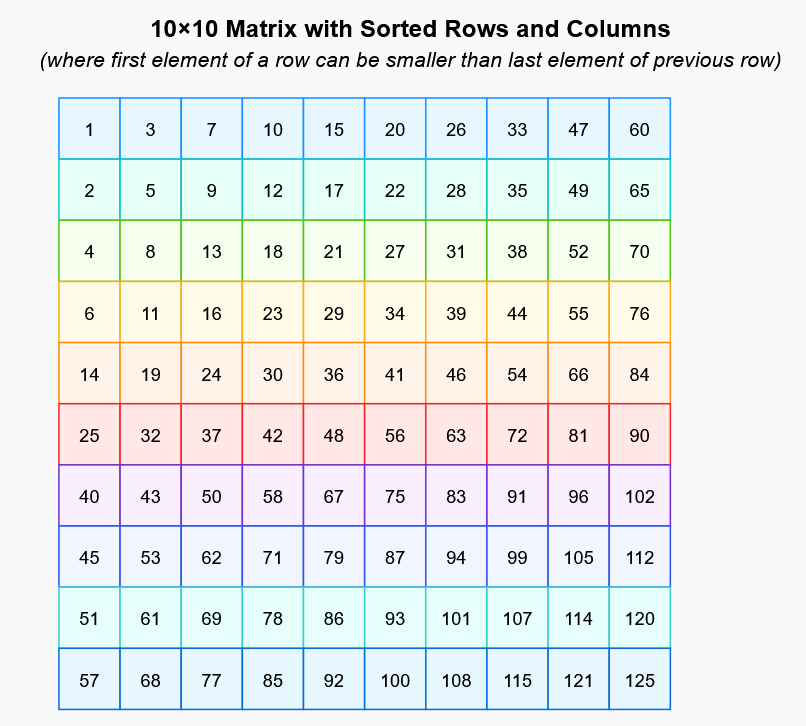

**The Goal**:  
Our main objective is to find the smallest value x in the possible range (matrix[0][0] to matrix[n-1][m-1]) such that the number of elements in the matrix less than or equal to x is at least k.

**Code:**
```cpp
int n, m;

int findSmallerAndEqual(vector<vector<int>>& arr, int num){
    int total = 0;
    int j = m-1;
    for(int i=0; i<n; ++i){
        while(j>=0 && arr[i][j]>num){
            j--;
        }

        total+=j+1;
    }

    return total;
}

int kthSmallest(vector<vector<int>>& matrix, int k) {
    n = matrix.size();
    m = matrix[0].size();
    
    int l = matrix[0][0];
    int r = matrix[n-1][m-1];
    int ans = -1;
    while(l<=r){
        int mid = l + (r-l)/2;
        int smallerOrEqual = findSmallerAndEqual(matrix, mid);
        if(smallerOrEqual >= k){
            ans = mid;
            r = mid - 1;
        }else if(smallerOrEqual < k){
            l = mid + 1;
        }
    }

    return ans;
}
```

### Detailed Flow of Counting Elements <= 41 in a Sorted Matrix


### Our Matrix (As a Reference)
```
[  1,   3,   7,  10,  15,  20,  26,  33,  47,  60]
[  2,   5,   9,  12,  17,  22,  28,  35,  49,  65]
[  4,   8,  13,  18,  21,  27,  31,  38,  52,  70]
[  6,  11,  16,  23,  29,  34,  39,  44,  55,  76]
[ 14,  19,  24,  30,  36,  41,  46,  54,  66,  84]
[ 25,  32,  37,  42,  48,  56,  63,  72,  81,  90]
[ 40,  43,  50,  58,  67,  75,  83,  91,  96, 102]
[ 45,  53,  62,  71,  79,  87,  94,  99, 105, 112]
[ 51,  61,  69,  78,  86,  93, 101, 107, 114, 120]
[ 57,  68,  77,  85,  92, 100, 108, 115, 121, 125]
```

### Step-by-Step Counting Process

We'll execute the algorithm to count elements ≤ 41:

```cpp
int findSmallerAndEqual(vector<vector<int>>& arr, int num){
    int total = 0;
    int j = m-1;
    for(int i=0; i<n; ++i){
        while(j>=0 && arr[i][j]>num){
            j--;
        }

        total+=j+1;
    }

    return total;
}
```

### Row 0 Processing
- Start with i=0, j=9
- Check matrix[0][9] = 60 > 41, so move left: j=8
- Check matrix[0][8] = 47 > 41, so move left: j=7
- Check matrix[0][7] = 33 ≤ 41, so we stop moving left
- Count elements in row 0 that are ≤ 41: j+1 = 7+1 = 8 elements
- Current count = 8

### Row 1 Processing
- Move to row 1, keep j=7
- Check matrix[1][7] = 35 ≤ 41, so we don't need to move left
- Count elements in row 1 that are ≤ 41: j+1 = 7+1 = 8 elements
- Current count = 8 + 8 = 16

### Row 2 Processing
- Move to row 2, keep j=7
- Check matrix[2][7] = 38 ≤ 41, so we don't need to move left
- Count elements in row 2 that are ≤ 41: j+1 = 7+1 = 8 elements
- Current count = 16 + 8 = 24

### Row 3 Processing
- Move to row 3, keep j=7
- Check matrix[3][7] = 44 > 41, so move left: j=6
- Check matrix[3][6] = 39 ≤ 41, so we stop moving left
- Count elements in row 3 that are ≤ 41: j+1 = 6+1 = 7 elements
- Current count = 24 + 7 = 31

### Row 4 Processing
- Move to row 4, keep j=6
- Check matrix[4][6] = 46 > 41, so move left: j=5
- Check matrix[4][5] = 41 ≤ 41, so we stop moving left
- Count elements in row 4 that are ≤ 41: j+1 = 5+1 = 6 elements
- Current count = 31 + 6 = 37

### Row 5 Processing
- Move to row 5, keep j=5
- Check matrix[5][5] = 56 > 41, so move left: j=4
- Check matrix[5][4] = 48 > 41, so move left: j=3
- Check matrix[5][3] = 42 > 41, so move left: j=2
- Check matrix[5][2] = 37 ≤ 41, so we stop moving left
- Count elements in row 5 that are ≤ 41: j+1 = 2+1 = 3 elements
- Current count = 37 + 3 = 40

### Row 6 Processing
- Move to row 6, keep j=2
- Check matrix[6][2] = 50 > 41, so move left: j=1
- Check matrix[6][1] = 43 > 41, so move left: j=0
- Check matrix[6][0] = 40 ≤ 41, so we stop moving left
- Count elements in row 6 that are ≤ 41: j+1 = 0+1 = 1 element
- Current count = 40 + 1 = 41

### Row 7 Processing
- Move to row 7, keep j=0
- Check matrix[7][0] = 45 > 41, so move left: j=-1
- Since j < 0, we're out of bounds, meaning no elements in this row are ≤ 41
- Count elements in row 7 that are ≤ 41: j+1 = -1+1 = 0 elements
- Current count = 41 + 0 = 41

### Row 8 Processing
- Move to row 8, keep j=-1
- Since j < 0, we're out of bounds, no elements in this row are ≤ 41
- Count elements in row 8 that are ≤ 41: j+1 = -1+1 = 0 elements
- Current count = 41 + 0 = 41

### Row 9 Processing
- Move to row 9, keep j=-1
- Since j < 0, we're out of bounds, no elements in this row are ≤ 41
- Count elements in row 9 that are ≤ 41: j+1 = -1+1 = 0 elements
- Current count = 41 + 0 = 41
