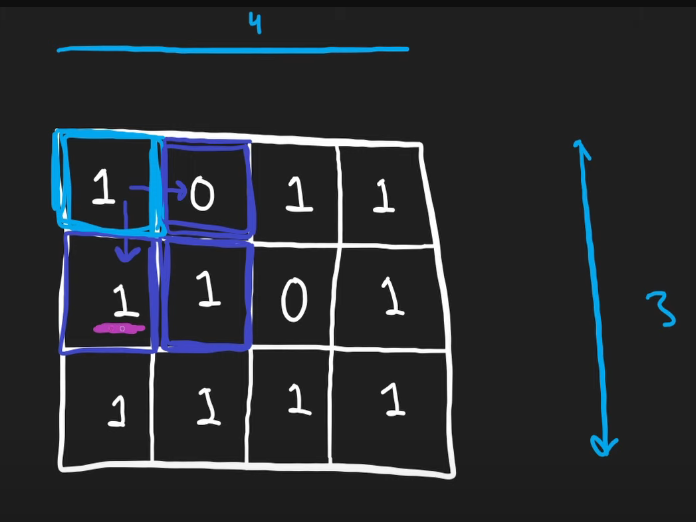

### Maximum size of Square possible - DP

[Link](https://leetcode.com/problems/maximal-square/description/)




```cpp
int maximalSquare(vector<vector<char>>& arr) {
    int n = arr.size();
    int m = arr[0].size();
    int ans = 0;

    vector<vector<int>> dp(n, vector<int>(m));

    // fill the last column
    for(int i=0; i<n; ++i){
        dp[i][m-1] = (arr[i][m-1]=='0')?0:1;
        ans = max(ans, dp[i][m-1]);
    }
    // fill the last row
    for(int j=0; j<m; ++j){
        dp[n-1][j] = (arr[n-1][j]=='0')?0:1;
        ans = max(ans, dp[n-1][j]);
    }

    for(int i=n-2; i>=0; i--){
        for(int j=m-2; j>=0; j--){
            if(arr[i][j]=='0'){
                dp[i][j] = 0;
            }
            else if(arr[i][j]=='1'){
                dp[i][j] = 1 + min(dp[i+1][j+1], min(dp[i][j+1], dp[i+1][j]));
            }

            ans = max(ans, dp[i][j]);
        }
    }

    return ans*ans;
}
```