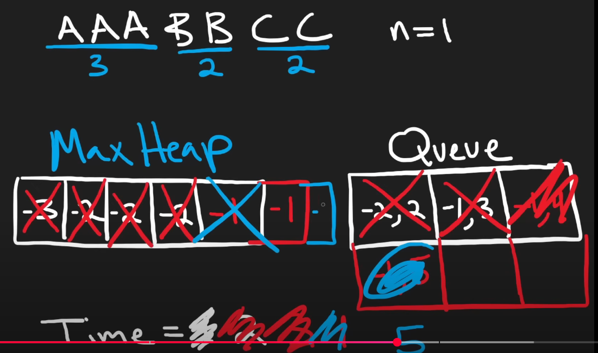

To solve LeetCode problem 621, "Task Scheduler," in C++ using a max heap and queue as outlined in the NeetCodeIO approach ([YouTube video](https://www.youtube.com/watch?v=s8p8ukTyA2I)), we need to schedule tasks with a cooldown period to minimize the total time. The solution uses a max heap to prioritize tasks with the highest remaining frequency and a queue to manage tasks that are temporarily blocked due to the cooldown.

### Approach
The approach uses:
- A **max heap** to store the frequency of tasks, prioritizing the task with the highest remaining count.
- A **queue** to store tasks that are on cooldown, along with the time they become available again.
- A time counter to track the current time unit and simulate the scheduling process.

**Steps**:
1. **Count Task Frequencies**: Create a frequency map for each task (e.g., {'A': 3, 'B': 3}).
2. **Initialize Max Heap**: Push the negative frequencies into a max heap (since C++ provides a min-heap, negate values to simulate a max heap).
3. **Process Tasks**:
   - While the heap or queue is not empty, increment the time counter.
   - Pop the task with the highest frequency from the heap (most frequent task).
   - Decrease its frequency by 1 (simulate executing it) and, if frequency remains, add it to the queue with a release time of `time + n + 1`.
   - Check the queue for tasks whose cooldown has expired (release time ≤ current time) and push them back to the heap.
4. **Return Time**: The final time counter gives the minimum time units needed.

#### C++ Solution

```cpp
class Solution {
public:
    int leastInterval(vector<char>& tasks, int n) {
        unordered_map<char, int> freq;
        for (char task : tasks) {
            freq[task]++;
        }
        
        priority_queue<int> maxHeap;
        for (const auto& pair : freq) {
            maxHeap.push(pair.second);
        }
        
        queue<pair<int, int>> q;
        int time = 0;
        
        while (!maxHeap.empty() || !q.empty()) {
            time++;
            
            while (!q.empty() && q.front().second <= time) {
                maxHeap.push(q.front().first);
                q.pop();
            }
            
            if (!maxHeap.empty()) {
                int freq = maxHeap.top();
                maxHeap.pop();
                freq--;
                if (freq > 0) {
                    q.push({freq, time + n + 1});
                }
            }
        }
        return time;
    }
};
```

<details>
<summary><span style="font-size:1em; font-family: 'consolas', monospace;">Full Code</span>
</summary>

```cpp
#include <vector>
#include <queue>
#include <unordered_map>
#include <iostream>

using namespace std;

class Solution {
public:
    int leastInterval(vector<char>& tasks, int n) {
        unordered_map<char, int> freq;
        for (char task : tasks) {
            freq[task]++;
        }
        
        // Step 2: Initialize max heap with negative frequencies
        priority_queue<int> maxHeap; // Max heap for frequencies
        for (const auto& pair : freq) {
            maxHeap.push(pair.second); // Push positive frequencies (C++ min-heap with negation)
        }
        
        // Step 3: Initialize queue for tasks on cooldown
        queue<pair<int, int>> q; // {frequency, release_time}
        int time = 0;
        
        // Step 4: Process tasks
        while (!maxHeap.empty() || !q.empty()) {
            time++; // Increment time unit
            
            // Process the queue: move tasks back to heap if cooldown is over
            while (!q.empty() && q.front().second <= time) {
                maxHeap.push(q.front().first); // Push frequency back to heap
                q.pop();
            }
            
            // Process the heap: execute the most frequent task
            if (!maxHeap.empty()) {
                int freq = maxHeap.top();
                maxHeap.pop();
                freq--; // Decrease frequency (task executed)
                if (freq > 0) {
                    // Add to queue with release time (time + n + 1)
                    q.push({freq, time + n + 1});
                }
            }
        }
        
        return time;
    }
};

int main() {
    Solution sol;
    
    // Test Case 1
    vector<char> tasks1 = {'A', 'A', 'A', 'B', 'B', 'B'};
    int n1 = 2;
    cout << "Test Case 1: " << sol.leastInterval(tasks1, n1) << endl; // Expected: 8
    
    // Test Case 2
    vector<char> tasks2 = {'A', 'A', 'A', 'B', 'B', 'B'};
    int n2 = 0;
    cout << "Test Case 2: " << sol.leastInterval(tasks2, n2) << endl; // Expected: 6
    
    // Test Case 3
    vector<char> tasks3 = {'A', 'A', 'A', 'A', 'A', 'A', 'B', 'C', 'D', 'E', 'F', 'G'};
    int n3 = 2;
    cout << "Test Case 3: " << sol.leastInterval(tasks3, n3) << endl; // Expected: 16
    
    // Test Case 4
    vector<char> tasks4 = {'A', 'B', 'C'};
    int n4 = 2;
    cout << "Test Case 4: " << sol.leastInterval(tasks4, n4) << endl; // Expected: 3
    
    return 0;
}
```
</details>


### Example Walkthrough (Test Case 1)
**Input**: `tasks = ["A","A","A","B","B","B"], n = 2`
- **Step 1**: `freq = {'A': 3, 'B': 3}`, maxHeap = `{3, 3}`, `time = 0`, `q = {}`
- **Time 1**: Pop 3 (A), freq = 2, push `{2, 4}` to q, maxHeap = `{3}`, `time = 1`
- **Time 2**: Pop 3 (B), freq = 2, push `{2, 5}` to q, maxHeap = `{}`, `time = 2`
- **Time 3**: Heap empty, q = `{{2, 4}, {2, 5}}`, idle, `time = 3`
- **Time 4**: Pop `{2, 4}` from q, maxHeap = `{2}`, pop 2 (A), freq = 1, push `{1, 7}` to q, `time = 4`
- **Time 5**: Pop `{2, 5}` from q, maxHeap = `{2}`, pop 2 (B), freq = 1, push `{1, 8}` to q, `time = 5`
- **Time 6**: Heap empty, q = `{{1, 7}, {1, 8}}`, idle, `time = 6`
- **Time 7**: Pop `{1, 7}` from q, maxHeap = `{1}`, pop 1 (A), freq = 0, `time = 7`
- **Time 8**: Pop `{1, 8}` from q, maxHeap = `{1}`, pop 1 (B), freq = 0, `time = 8`
- **End**: Heap and queue empty, return `time = 8`
- **Output**: `8` (Schedule: A, B, idle, A, B, idle, A, B)

