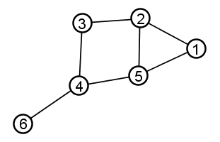
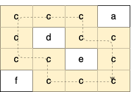
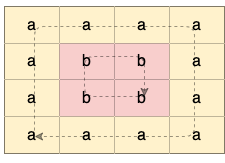

## • Nodal Graph

<div style="text-align: center;">
  
</div>  
  
‎  

<details>
<summary><span style="font-size:1em; font-family: 'consolas', monospace;">a. Using BFS</span>
</summary>

```cpp
bool findCycle(int curRoot, vector<vector<int>>& adj, vector<bool>& visited){
    queue<pair<int, int>> q;    // queue <curNode, preNode>
    q.push({curRoot, curRoot});

    while(q.size()){
        int curNode = q.front().first;
        int preNode = q.front().second;
        q.pop();
        visited[curNode] = true;

        for(int i=0; i<adj[curNode].size(); ++i){
            int newNode = adj[curNode][i];
            if(newNode!=preNode){
                if(visited[newNode] == true){
                    return true;
                }
                q.push({newNode, curNode});
                visited[newNode] = true;
            }
        }
    }

    return false;
}

bool cycleDetection (vector<vector<int>>& edges, int n, int m)
{
    vector<vector<int>> adj(n+1);
    for(int i=0; i<m; ++i){
        adj[edges[i][0]].push_back(edges[i][1]);
        adj[edges[i][1]].push_back(edges[i][0]);
    }

    vector<bool> visited(n+1, false);

    for(int curNode=1; curNode<=n; ++curNode){
        if(visited[curNode] == false){
            bool isCycle = findCycle(curNode, adj, visited);
            if(isCycle){
                return true;
            }
        }
    }

    return false;
}
```
</details>


##  • 2D Grid

<div style="text-align: center;">
  
  
</div>  
    
‎  
‎ 

<details>
<summary><span style="font-size:1em; font-family: 'consolas', monospace;">a. Using BFS</span>
</summary>

```cpp
vector<int> dx{0, 0, 1, -1};
vector<int> dy{1, -1, 0, 0};
int rowLim;
int colLim;

struct node{
    int row;
    int col;
    node(int row, int col) : row{row}, col{col} {}
};

bool isValid(int curRow, int curCol){
    return (curRow>=0 && curRow<rowLim && curCol>=0 && curCol<colLim);
}

bool findCycle(int rootRow, int rootCol, vector<vector<char>>& grid, vector<vector<bool>>& visited){
    queue<pair<node, node>> q;  // q <curNode, rootNode>
    q.push( make_pair(node(rootRow, rootCol), node(-1, -1)) );
    
    while(q.size()){
        node curNode = q.front().first;
        node preNode = q.front().second;
        int curRow = curNode.row;
        int curCol = curNode.col;
        int preRow = preNode.row;
        int preCol = preNode.col;

        q.pop();

        if(visited[curRow][curCol] == true){
            return true;
        }

        visited[curRow][curCol] = true;

        for(int i=0; i<4; ++i){
            int newRow = curRow + dy[i];
            int newCol = curCol + dx[i];
            if(isValid(newRow, newCol) && grid[curRow][curCol] == grid[newRow][newCol] 
                && !(newRow==preRow && newCol==preCol)){
                q.push(make_pair(node(newRow, newCol), curNode));
            }
        }
    }

    return false;
}

bool containsCycle(vector<vector<char>>& grid) {
    rowLim = grid.size();
    colLim = grid[0].size();
    vector<vector<bool>> visited(grid.size(), vector<bool>(grid[0].size(), false));

    for(int i=0; i<grid.size(); ++i){
        for(int j=0; j<grid[0].size(); ++j){
            if(visited[i][j] == false){
                bool hasCycle = findCycle(i, j, grid, visited);
                if(hasCycle){
                    return true;
                }
            }
        }
    }

    // no cycle found
    return false;
}
```
</details>