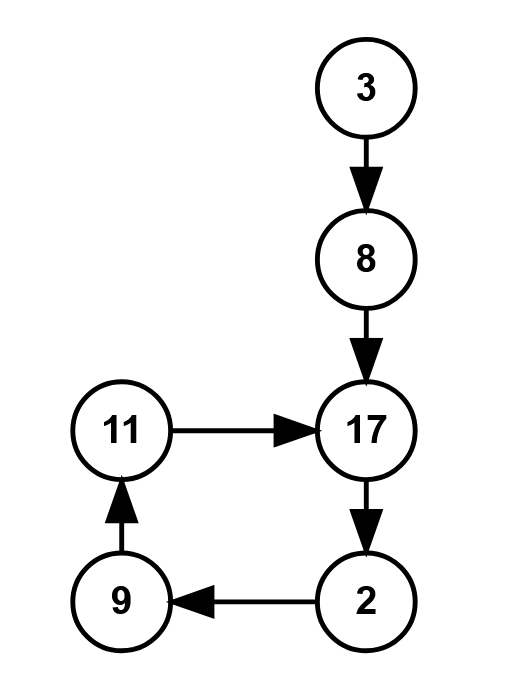

<!-- problem:start -->

# [2360. Longest Cycle in a Graph](https://leetcode.com/problems/longest-cycle-in-a-graph)

## Description

<!-- description:start -->

<p>You are given a <strong>directed</strong> graph of <code>n</code> nodes numbered from <code>0</code> to <code>n - 1</code>, where each node has <strong>at most one</strong> outgoing edge.</p>

<p>The graph is represented with a given <strong>0-indexed</strong> array <code>edges</code> of size <code>n</code>, indicating that there is a directed edge from node <code>i</code> to node <code>edges[i]</code>. If there is no outgoing edge from node <code>i</code>, then <code>edges[i] == -1</code>.</p>

<p>Return <em>the length of the <strong>longest</strong> cycle in the graph</em>. If no cycle exists, return <code>-1</code>.</p>

<p>A cycle is a path that starts and ends at the <strong>same</strong> node.</p>

<p>&nbsp;</p>
<p><strong class="example">Example 1:</strong></p>

<pre>
<strong>Input:</strong> edges = [3,3,4,2,3]
<strong>Output:</strong> 3
<strong>Explanation:</strong> The longest cycle in the graph is the cycle: 2 -&gt; 4 -&gt; 3 -&gt; 2.
The length of this cycle is 3, so 3 is returned.
</pre>

<p><strong class="example">Example 2:</strong></p>

<pre>
<strong>Input:</strong> edges = [2,-1,3,1]
<strong>Output:</strong> -1
<strong>Explanation:</strong> There are no cycles in this graph.
</pre>

<p>&nbsp;</p>
<p><strong>Constraints:</strong></p>

<ul>
	<li><code>n == edges.length</code></li>
	<li><code>2 &lt;= n &lt;= 10<sup>5</sup></code></li>
	<li><code>-1 &lt;= edges[i] &lt; n</code></li>
	<li><code>edges[i] != i</code></li>
</ul>

<!-- description:end -->

## Solutions

<!-- solution:start -->

### Solution 1: Traverse Starting Points

We can traverse each node in the range $[0,..,n-1]$. If a node has not been visited, we start from this node and search for adjacent nodes until we encounter a cycle or a node that has already been visited. If we encounter a cycle, we update the answer.

The time complexity is $O(n)$ and the space complexity is $O(n)$, where $n$ is the number of nodes.

Similar problems:

-   [2127. Maximum Employees to Be Invited to a Meeting](https://github.com/doocs/leetcode/blob/main/solution/2100-2199/2127.Maximum%20Employees%20to%20Be%20Invited%20to%20a%20Meeting/README.md)

<!-- tabs:start -->

#### C++

```cpp
class Solution {
public:
    int longestCycle(vector<int>& edges) {
        int n = edges.size();
        int ans = -1;
        vector<bool> visited(n, false);
        for(int i=0; i<n; ++i){
            if(visited[i] == true){
                continue;
            }

            int curNode = i;
            vector<int> curTour;
            while(curNode!=-1 && visited[curNode]==false){
                curTour.push_back(curNode);
                visited[curNode] = true;
                curNode = edges[curNode];
            }
            int lastNode = curNode;
            /* only 2 possible scenario to be here.
               1: curNode == -1, i.e. this tour was not a cycle. */
            if(curNode == -1){
                continue;
            }
            
            /* 2: visited[curNode] == true;
               it can be a cycle, it cannot be a cycle also.
               for it to be a cycle, lastNode must be present in the curTour */
            for(int i=0; i<curTour.size(); ++i){
                if(curTour[i] == lastNode){
                    int len = curTour.size() - i;
                    ans = max(ans, len);
                }
            }
        }

        return ans;
    }
};
```

Dry run with the following image:
After tour completion, 
curTour will be [ 3, 8, 17, 2, 9, 11 ]
and the lastNode will 17
    if(curTour[i] == curNode)
        int len = curTour.size() - i;

<!-- tabs:end -->

<!-- solution:end -->

<!-- problem:end -->